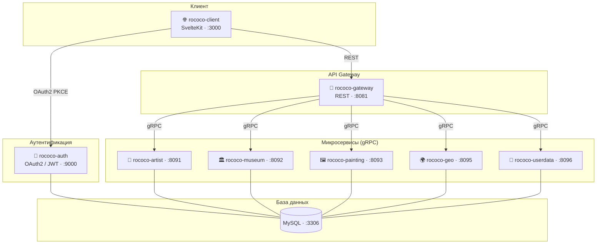

# 🎨 Rococo — сервис для управления данными о художниках, музеях и произведениях искусства.
Дипломный проект: микросервисное приложение с REST/gRPC API, OAuth2-аутентификацией и автотестами.
---

## 🛠️ Используемые инструменты и технологии

<p align="center">
  <a href="https://www.java.com/" rel="nofollow"></a>
  <a href="https://gradle.org/" rel="nofollow"></a>
  <a href="https://spring.io/" rel="nofollow"></a>
  <a href="https://spring.io/projects/spring-boot" rel="nofollow"></a>
  <a href="https://grpc.io/" rel="nofollow"></a>
  <a href="https://www.docker.com/" rel="nofollow"></a>
  <a href="https://www.mysql.com/" rel="nofollow"></a>
  <a href="https://svelte.dev/" rel="nofollow"></a>
  <a href="https://junit.org/junit5/" rel="nofollow"></a>
  <a href="https://selenide.org/" rel="nofollow"></a>
  <a href="https://qameta.io/allure/" rel="nofollow"></a>
  <a href="https://aerokube.com/selenoid/" rel="nofollow"></a>
  <a href="https://github.com/fescobar/allure-docker-service"></a>
  <a href="https://github.com/features/actions"></a>
  <a href="https://github.com/"></a>
  <a href="https://www.jetbrains.com/idea/" rel="nofollow"></a>
</p>

---

## 📁 Структура проекта

```
rococo/
├── rococo-grpc-common/   # Общий модуль с proto-файлами (gRPC-контракты)
├── rococo-gateway/       # API Gateway — единая точка входа для фронта (REST → gRPC)
├── rococo-auth/          # Сервис аутентификации (OAuth2 / JWT) | БД: rococo-auth
├── rococo-userdata/      # Сервис профилей пользователей | БД: rococo-userdata
├── rococo-artist/        # Сервис художников (CRUD) | БД: rococo-artist
├── rococo-museum/        # Сервис музеев (CRUD) | БД: rococo-museum
├── rococo-painting/      # Сервис картин (CRUD) | БД: rococo-painting
├── rococo-geo/           # Сервис геоданных (страны) | БД: rococo-geo
├── rococo-client/        # Фронтенд (SvelteKit)
└── rococo-tests/         # Автотесты (JUnit 5, Selenide, Allure)
```

---

## 🏗️ Архитектура



---

## 🖥️ Режим 1 — Локально без Docker

### Требования
- Java 21, Node.js, Docker Desktop (только для MySQL)

### 1. Запуск MySQL

```bash
bash localenv.sh
```

### 2. Запуск микросервисов

Запустить каждый сервис из IntelliJ IDEA (класс `@SpringBootApplication`) или через Gradle:

```bash
./gradlew :rococo-auth:bootRun --no-daemon &
./gradlew :rococo-geo:bootRun --no-daemon &
./gradlew :rococo-artist:bootRun --no-daemon &
./gradlew :rococo-museum:bootRun --no-daemon &
./gradlew :rococo-painting:bootRun --no-daemon &
./gradlew :rococo-userdata:bootRun --no-daemon &
./gradlew :rococo-gateway:bootRun --no-daemon &
```

| Сервис | Класс |
|---|---|
| `rococo-auth` | `RococoAuthApplication` |
| `rococo-geo` | `RococoGeoApplication` |
| `rococo-artist` | `RococoArtistApplication` |
| `rococo-museum` | `RococoMuseumApplication` |
| `rococo-painting` | `RococoPaintingApplication` |
| `rococo-userdata` | `RococoUserdataApplication` |
| `rococo-gateway` | `RococoGatewayApplication` |

### 3. Запуск фронтенда

```bash
cd rococo-client
npm install
npm run dev
```

Фронтенд: [http://localhost:3000](http://localhost:3000)

### 4. Запуск тестов

Chrome откроется локально (Selenoid не нужен).

```bash
./gradlew :rococo-tests:test --no-daemon
```

Отчёт после завершения:

```bash
allure serve rococo-tests/build/allure-results
```

---

## 🐳 Режим 2 — Локально в Docker

### Требования
- Docker Desktop

### 1. Сборка JAR-файлов сервисов

```bash
./gradlew :rococo-userdata:bootJar :rococo-artist:bootJar :rococo-museum:bootJar \
          :rococo-painting:bootJar :rococo-geo:bootJar :rococo-gateway:bootJar \
          -x test --no-daemon
```

> `rococo-auth` собирается внутри Docker (многоэтапный Dockerfile).

### 2. Запуск микросервисов

```bash
docker compose -f docker-compose-services.yml up -d --build
```

Фронтенд: [http://localhost:3000](http://localhost:3000)

### 3. Запуск тестов

Без Allure UI (только тесты):

```bash
docker compose -f docker-compose-tests.yml up --build
```

С Allure UI и Selenoid UI:

```bash
docker compose --profile local -f docker-compose-tests.yml up --build
```

### 4. Просмотр Allure-отчёта

После завершения тестов с `--profile local`:

👉 [http://localhost:5050/allure-docker-service/projects/default/reports/latest/index.html](http://localhost:5050/allure-docker-service/projects/default/reports/latest/index.html)

Selenoid UI (наблюдение за браузерами в реальном времени):

👉 [http://localhost:8080](http://localhost:8080)

### 5. Остановка

```bash
docker compose -f docker-compose-services.yml down -v
docker compose -f docker-compose-tests.yml down -v
```

---

## ⚙️ Режим 3 — GitHub Actions

Пайплайн запускается автоматически при `push` и `pull_request` в ветку `main`, а также вручную через `workflow_dispatch`.

Шаги пайплайна:
1. Сборка JAR-файлов сервисов
2. Запуск всех микросервисов в Docker
3. Ожидание готовности всех API (`/oauth2/jwks`, `/api/country`, `/api/artist`, `/api/museum`, `/api/painting`)
4. Запуск тестов
5. Генерация Allure-отчёта

Allure-отчёт доступен:
- 📦 Как артефакт в разделе **Actions → выбрать запуск → Artifacts → allure-report**
- 🌐 На GitHub Pages: `https://siraxle.github.io/rococo/` (нужно включить Pages в настройках репозитория: Settings → Pages → Branch: `gh-pages`)

---

## 📝 Примечания

- Все микросервисы общаются через **gRPC**
- Фронтенд общается только с **API Gateway** (порт `8081`)
- Каждый сервис (кроме Gateway) имеет собственную БД **MySQL**
- Тесты используют **JUnit 5**, **Retrofit**, **gRPC**, **Selenide**, **Allure**
- БД создаются автоматически через **Flyway** при первом запуске
